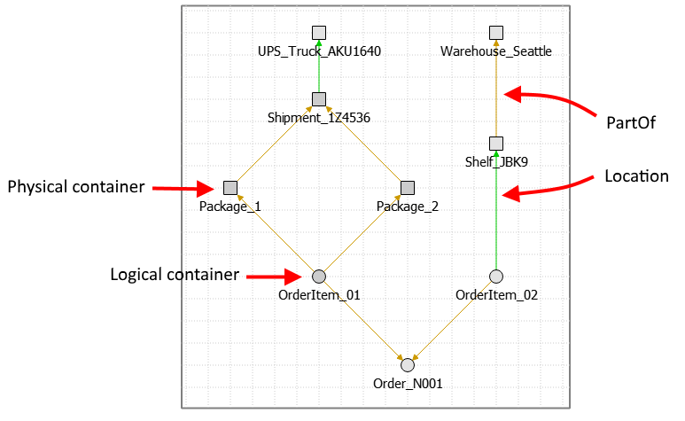

[](https://github.com/Naereen/StrapDown.js/blob/master/LICENSE)

# GV to GraphSON converter

This is a simple utility that converts GraphViz GV file to TinkerPop GraphSON format. It can convert visual attributes to node/edge labels. I use it with [Qt Visual Graph Editor](https://github.com/ArsMasiuk/qvge), which has export to GV.

Utility converts node labels to property "name". If node has no label utility generates warning and uses original NodeId as "name".

## Installation and usage

* Install Python (tested with Python 3 only)
* pip install pydot
* Download [gv2graphson.py](https://raw.githubusercontent.com/sanychsamara/gv2graphson/master/gv2graphson.py) from this repository
* Run "python.exe gv2graphson.py -f test_graph.gv"

Full list of options


```plaintext
gv2graphson.py [-h] -f FILENAME [-n NODELABEL] [-e EDGELABEL] [-c EDGECOLOR] [-t EDGETHICKNESS] [-s EDGESTYLE] [-p NODESHAPE]

optional arguments:
  -h, --help            show this help message and exit
  -f FILENAME, --filename FILENAME
                        Input filename in GraphViz DV format
  -n NODELABEL, --nodelabel NODELABEL
                        Node label. Defaults to 'node'.
  -e EDGELABEL, --edgelabel EDGELABEL
                        Edge label. Defaults to 'edge'.
  -c EDGECOLOR, --edgecolor EDGECOLOR
                        Edge color to label mapping. Example: #cc9900=parent
  -t EDGETHICKNESS, --edgethickness EDGETHICKNESS
                        Edge thickness to label mapping. Example: 2=parent
  -s EDGESTYLE, --edgestyle EDGESTYLE
                        Edge style to label mapping. Example: dotted=parent
  -p NODESHAPE, --nodeshape NODESHAPE
                        Node shape to label mapping. Example: rect=person
```


## Example

Let's say you have following graph built in Qt Visual Graph Editor. You used color "brown" to specify relationship "part_of" and color "green" for relationship "location". You also used round nodes for "logical containers" and square nodes for "physical containers".



This is the command you would run. Note that "ellipse" is a default visual attribute and not saved with each node. Therefore instead of "-p ellipse=physical" you would need to override default node label as "-n logical".

```plaintext
gv2graphson.py -f test_graph.gv -c #cc9900=part_of -c #00cc00=location -n logical -p rect=physical
```

Output file "test_graph.json" gets created in the same folder as input file and has extension "json". To verify conversion launch Gremlin Console and try following.

```java
Graph graph = TinkerGraph.open();
graph.io(IoCore.graphson()).readGraph("test_graph.json");

g = graph.traversal()
g.V().union(label(),values('name'))
g.E().label()
g.V().has("name", "Order_N001").in().repeat(out()).until(hasLabel("physical")).values("name")

// Last command output should look like
==>Package_2
==>Package_1
==>Shelf_JBK9
```

## Related Projects

There are 2 other similar converters on GitHub. One is written on Perl and one on Haskel. 
Neither of them offers attributes-to-label mappings.

* https://metacpan.org/pod/distribution/Graph-Easy/bin/graph-easy
* https://github.com/portnov/dot2graphml/blob/master/dot2graphml.hs